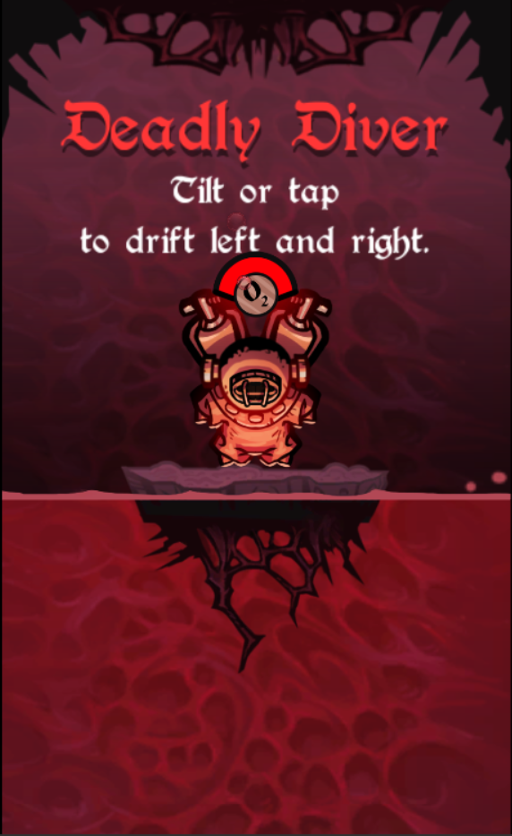
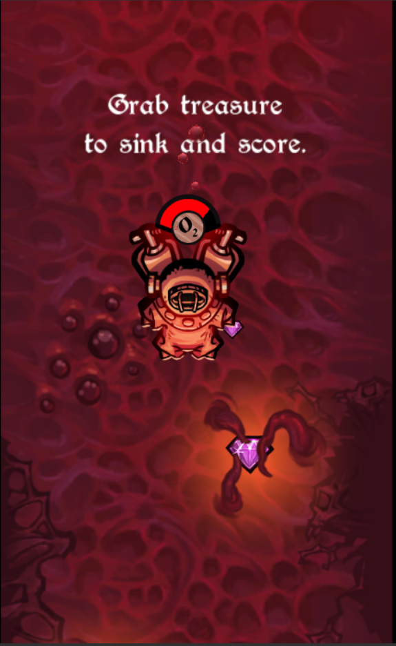
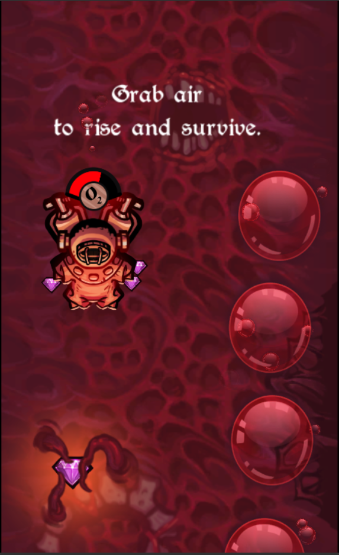
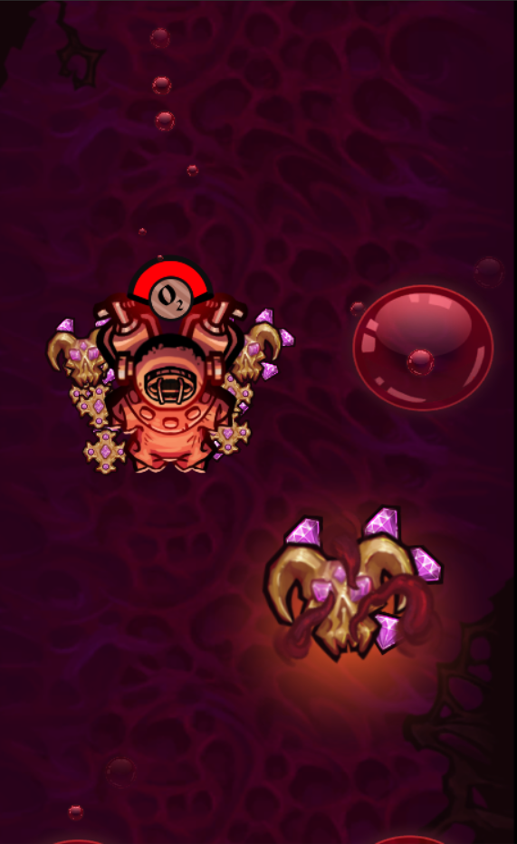
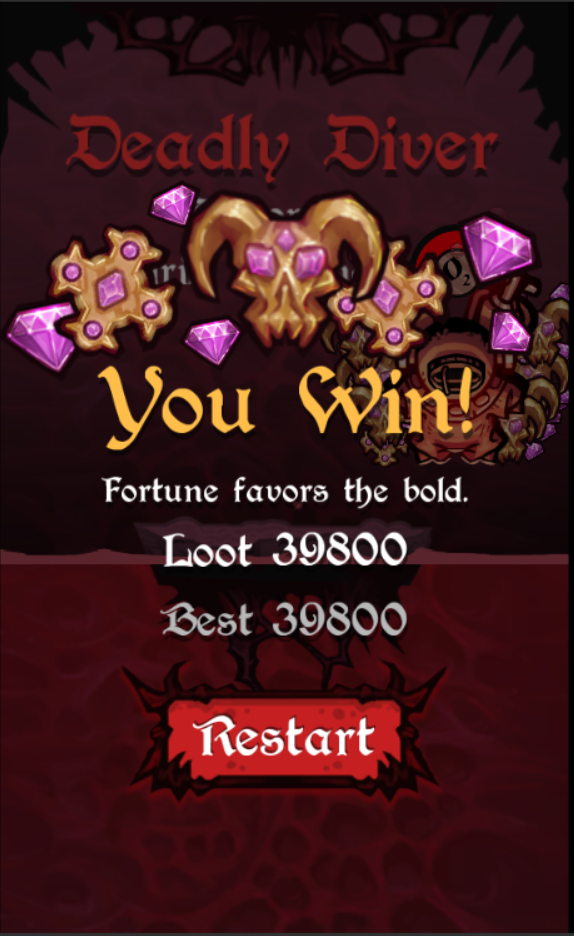

# Deadly Diver

Brendan Milos's and my game Jam Dec 1st - 4th, 2017.

Play the game and comment at:

<https://ldjam.com/events/ludum-dare/40/$50465>

Instructions:

- Tilt or tap to drift left or right.
- Grab treasure to sink and score.
- Grab air to rise and survive.

# Credits

- Art:  Brendan Milos
- Programming:  Ethan Kennerly
- Engine: Unity 5.6
- Audio:  freesound.org
